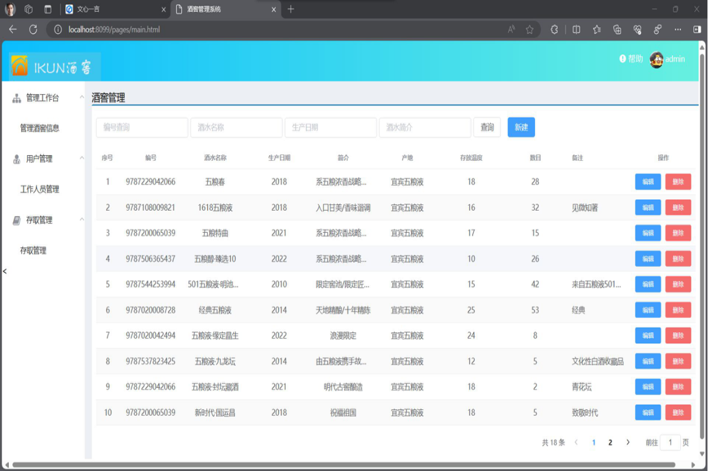
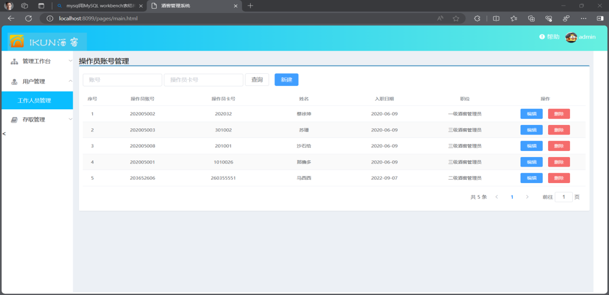
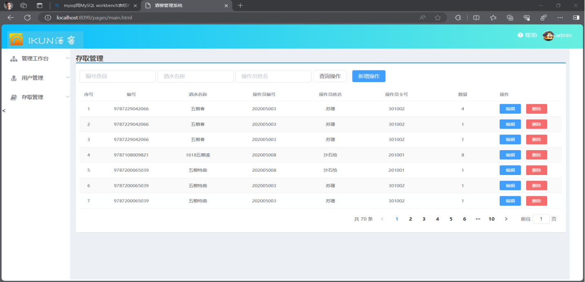

# 酒窖管理系统

# 📝项目介绍

#### 项目技术栈👏👏

酒窖管理系统，采用SpringBoot+Mybatius，页面使用Element框架，使用RESTful API风格编写接口。

数据库使用mysql

- Spring Boot

- MyBatis-puls

- MySQL

- ElementUI

#### 项目工具:  

🤞🤞

IntelliJ IDEA 2023.2.2+Navicat Premium 16+ElementUI

#### 已实现功能

- [x] 基本增删改查,联表查询


- 

  

# 🌹项目预览

账号:admin 密码:123456

#### 登录页面


#### 酒窖信息管理



#### 工作人员管理



#### 库存存取管理




## ✔数据库设计

#### 工作人员表

```sql
DROP TABLE IF EXISTS `tbl_worker`;
CREATE TABLE `tbl_worker`  (
  `id` int(20) NOT NULL AUTO_INCREMENT,
  `worker_id` varchar(32) CHARACTER SET utf8 COLLATE utf8_general_ci NULL DEFAULT NULL,
  `worker_name` varchar(20) CHARACTER SET utf8 COLLATE utf8_general_ci NOT NULL,
  `card_id` int(32) NULL DEFAULT NULL,
  `education` varchar(20) CHARACTER SET utf8 COLLATE utf8_general_ci NULL DEFAULT NULL,
  `create_date` date NULL DEFAULT NULL,
  PRIMARY KEY (`id`) USING BTREE,
  INDEX `worker_id`(`worker_id`) USING BTREE
) ENGINE = InnoDB AUTO_INCREMENT = 8 CHARACTER SET = utf8 COLLATE = utf8_general_ci ROW_FORMAT = Compact;
```


#### 登录用户表

```sql
DROP TABLE IF EXISTS `tbl_user`;
CREATE TABLE `tbl_user`  (
  `id` int(11) NOT NULL AUTO_INCREMENT,
  `user_id` varchar(20) CHARACTER SET utf8 COLLATE utf8_general_ci NULL DEFAULT NULL,
  `login_name` varchar(20) CHARACTER SET utf8 COLLATE utf8_general_ci NULL DEFAULT NULL,
  `user_name` varchar(20) CHARACTER SET utf8 COLLATE utf8_general_ci NULL DEFAULT NULL,
  `password` varchar(20) CHARACTER SET utf8 COLLATE utf8_general_ci NULL DEFAULT NULL,
  `status` varchar(11) CHARACTER SET utf8 COLLATE utf8_general_ci NULL DEFAULT NULL,
  `create_date` date NULL DEFAULT NULL,
  PRIMARY KEY (`id`) USING BTREE
) ENGINE = MyISAM AUTO_INCREMENT = 6 CHARACTER SET = utf8 COLLATE = utf8_general_ci ROW_FORMAT = Dynamic;
```


#### 存取表

```sql
-- ----------------------------
DROP TABLE IF EXISTS `tbl_access`;
CREATE TABLE `tbl_access`  (
  `isbn_log` varchar(50) CHARACTER SET utf8 COLLATE utf8_general_ci NOT NULL,
  `winename_log` varchar(50) CHARACTER SET utf8 COLLATE utf8_general_ci NULL DEFAULT NULL,
  `workerid_log` varchar(50) CHARACTER SET utf8 COLLATE utf8_general_ci NOT NULL,
  `workname_log` varchar(50) CHARACTER SET utf8 COLLATE utf8_general_ci NULL DEFAULT NULL,
  `cardid_log` varchar(50) CHARACTER SET utf8 COLLATE utf8_general_ci NULL DEFAULT NULL,
  `num` int(15) NOT NULL DEFAULT 1,
  `id` int(10) NOT NULL AUTO_INCREMENT,
  PRIMARY KEY (`id`) USING BTREE,
  INDEX `isbn_log`(`isbn_log`) USING BTREE,
  INDEX `workerid_log`(`workerid_log`) USING BTREE,
  CONSTRAINT `isbn_log` FOREIGN KEY (`isbn_log`) REFERENCES `tbl_book` (`isbn`) ON DELETE RESTRICT ON UPDATE RESTRICT,
  CONSTRAINT `tbl_access_ibfk_1` FOREIGN KEY (`workerid_log`) REFERENCES `tbl_worker` (`worker_id`) ON DELETE RESTRICT ON UPDATE RESTRICT
) ENGINE = InnoDB AUTO_INCREMENT = 145 CHARACTER SET = utf8 COLLATE = utf8_general_ci ROW_FORMAT = Compact;
```

#### 酒水信息表

```sql
DROP TABLE IF EXISTS `tbl_wine`;
CREATE TABLE `tbl_wine`  (
  `id` int(11) NOT NULL AUTO_INCREMENT,
  `isbn` varchar(32) CHARACTER SET utf8 COLLATE utf8_general_ci NOT NULL,
  `wine_name` varchar(255) CHARACTER SET utf8 COLLATE utf8_general_ci NULL DEFAULT NULL,
  `date` varchar(255) CHARACTER SET utf8 COLLATE utf8_general_ci NULL DEFAULT NULL,
  `synopsis` varchar(255) CHARACTER SET utf8 COLLATE utf8_general_ci NULL DEFAULT NULL COMMENT '简介',
  `place` varchar(255) CHARACTER SET utf8 COLLATE utf8_general_ci NULL DEFAULT NULL,
  `temperature` date NULL DEFAULT NULL,
  `last` int(11) NULL DEFAULT NULL,
  `notes` varchar(255) CHARACTER SET utf8 COLLATE utf8_general_ci NULL DEFAULT NULL,
  PRIMARY KEY (`id`) USING BTREE,
  INDEX `isbn`(`isbn`) USING BTREE
) ENGINE = InnoDB AUTO_INCREMENT = 64 CHARACTER SET = utf8 COLLATE = utf8_general_ci ROW_FORMAT = Compact;
```

# 
